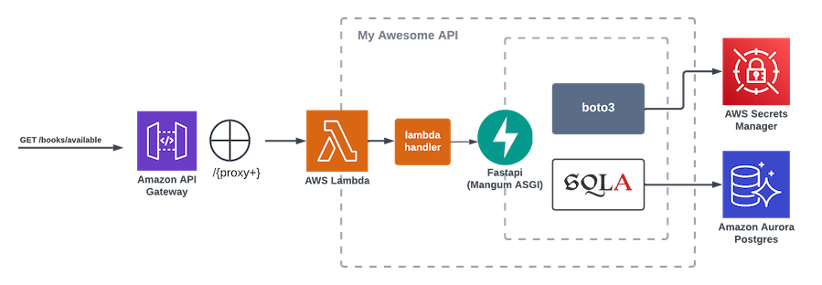

# My Awesome API: A Guide to Using Amazon RDS with Lambda, FastAPI and SQLAlchemy


## Overview

My Awesome API is a sample library backend designed to allow users to browse and borrow books. This project was created as part of a series of articles that explore the practical application of the Python, FastAPI, and SQLAlchemy, highlighting its growing popularity, ease of setup, and performance in real-world scenarios. The goal is to showcase how this modern stack can be leveraged to build efficient, scalable serverless APIs using AWS RDS and Lambda. 

For demonstrating purposes it represents all of the basic database relationships such as one-to-one, one-to-many & many-to-many.

The infrastructure is coded with Terraform and the setup consists of following AWS resources:

- AWS VPC with private subnets
- Amazon Aurora RDS
- RDS Proxy
- Database credentials stored in Secrets Manager
- Amazon API Gateway
- Lambda & Lambda Layer


## Prerequisites

For local env:
- Python 3.12+
- Docker

For cloud:
- Terraform
- AWS CLI configured


## Installation

### Local

1. **Create a virtual environment:**

    ```bash
    python -m venv venv
    source venv/bin/activate  # On Windows: venv\Scripts\activate
    Install dependencies:
    ```

2. **Install dependencies:**
    ```bash
    pip install -r requirements.txt
    ```

3. **Set up environment variables:**

    Ensure that the necessary environment variables are set, either through a .env file or directly in your environment:

    
    ```.env
    ENV=<environment-either-local-or-dev>
    USE_PROXY=<whether-to-use-proxy>
    MY_IP=<your-ip-address-to-access-database-from-local>
    MY_AWS_REGION=<your-region>
    MY_AWS_PROFILE=<aws-profile-if-needed>
    AWS_SECRET_NAME=db_credentials
    DATABASE_NAME=<database-name>
    DATABASE_ENDPOINT=<database-endpoint-localhost-or-aws-endpoint>
    RDS_PROXY_ENDPOINT=<rds-proxy-endpoint>
    DATABASE_PORT=<database-port>
    DATABASE_USERNAME=<for-local-env>
    DATABASE_PASSWORD=<for-local-env>
    DATASET_BATCH_SIZE=<batch-size-for-populate-database-script>
    DATASET_AUTHORS_AMOUNT=<dataset-sizes-for-populate-database-script>
    DATASET_BOOKS_AMOUNT=<dataset-sizes-for-populate-database-script>
    DATASET_LOANS_AMOUNT=<dataset-sizes-for-populate-database-script>
    DATASET_BORROWERS_AMOUNT=<dataset-sizes-for-populate-database-script>
    DATASET_REVIEWS_AMOUNT=<dataset-sizes-for-populate-database-script>
    ```

4. **Set up database:**

    ```bash
    docker-compose -f docker/docker-compose-database.yaml --env-file ./.env up
    ```

5. **Populate database with test data:**

    ```bash
    python ./data/create_dataset.py
    ```

6. **Run the API**

    ```bash
    fastapi dev main.py
    ```

### Cloud

1. **Install Terraform**

    https://developer.hashicorp.com/terraform/tutorials/aws-get-started/install-cli

2. **Set up environment variables:**

    Ensure that the necessary environment variables are set, either through a .env file or directly in your environment:

    
    ```.env
    ENV=<environment-either-local-or-dev>
    USE_PROXY=<whether-to-use-proxy>
    MY_IP=<your-ip-address-to-access-database-from-local>
    MY_AWS_REGION=<your-region>
    MY_AWS_PROFILE=<aws-profile-if-needed>
    AWS_SECRET_NAME=db_credentials
    DATABASE_NAME=<database-name>
    DATASET_BATCH_SIZE=<batch-size-for-populate-database-script>
    DATASET_AUTHORS_AMOUNT=<dataset-sizes-for-populate-database-script>
    DATASET_BOOKS_AMOUNT=<dataset-sizes-for-populate-database-script>
    DATASET_LOANS_AMOUNT=<dataset-sizes-for-populate-database-script>
    DATASET_BORROWERS_AMOUNT=<dataset-sizes-for-populate-database-script>
    DATASET_REVIEWS_AMOUNT=<dataset-sizes-for-populate-database-script>
    ```

4. **Run Terraform:**

    ```bash
    cd infra
    terraform init
    terraform apply
    ```

5. **Collect outputs from Terraform:**

    * database_endpoint
    * rds_proxy_endpoint

6. **Fill in rest of the environment variables:**

    After terraform has run first time fill in the rest of env variables

    ```.env
    DATABASE_ENDPOINT=<database-endpoint-localhost-or-aws-endpoint>
    RDS_PROXY_ENDPOINT=<rds-proxy-endpoint>
    ```


7. **Run Terraform again:**

    ```bash
    cd infra
    terraform init
    terraform apply
    ```

5. **Populate database with test data:**

    ```bash
    python ./data/create_dataset.py
    ```

6. **Navigate to api gateway endpoint to see API docs**

    From terraform outputs collect the apigw_endpoint_url:

    and navigate to URL:

    https://<apigw_endpoint_url>.execute-api.eu-west-1.amazonaws.com/docs#